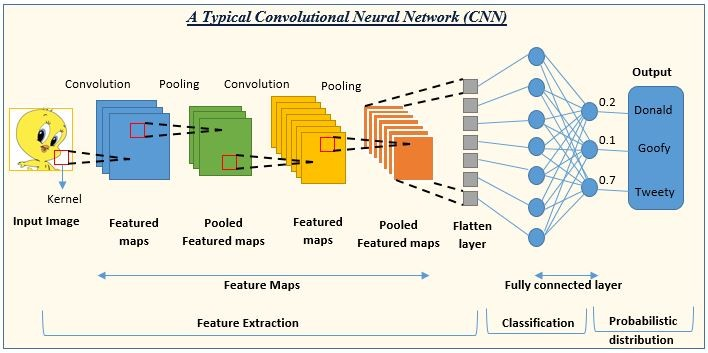
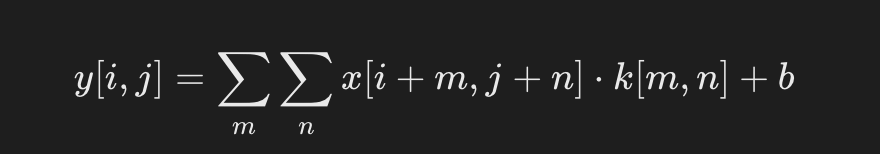
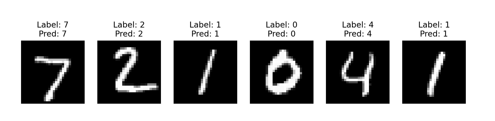

## PyTorch 卷积神经网络

PyTorch 卷积神经网络 (Convolutional Neural Networks, CNN) 是一类专门用于处理具有网格状拓扑结构数据（如图像）的深度学习模型。

CNN 是计算机视觉任务（如图像分类、目标检测和分割）的核心技术。

下面这张图展示了一个典型的卷积神经网络（CNN）的结构和工作流程，用于图像识别任务。



在图中，CNN 的输出层给出了三个类别的概率：Donald（0.2）、Goofy（0.1）和Tweety（0.7），这表明网络认为输入图像最有可能是 Tweety。

以下是各个部分的简要说明：

- 输入图像（Input Image）：网络接收的原始图像数据。

- 卷积（Convolution）：使用卷积核（Kernel）在输入图像上滑动，提取特征，生成特征图（Feature Maps）。

- 池化（Pooling）：通常在卷积层之后，通过最大池化或平均池化减少特征图的尺寸，同时保留重要特征，生成池化特征图（Pooled Feature Maps）。

- 特征提取（Feature Extraction）：通过多个卷积和池化层的组合，逐步提取图像的高级特征。

- 展平层（Flatten Layer）：将多维的特征图转换为一维向量，以便输入到全连接层。

- 全连接层（Fully Connected Layer）：类似于传统的神经网络层，用于将提取的特征映射到输出类别。

- 分类（Classification）：网络的输出层，根据全连接层的输出进行分类。

- 概率分布（Probabilistic Distribution）：输出层给出每个类别的概率，表示输入图像属于各个类别的可能性。

## 卷积神经网络的基本结构
### 1、输入层（Input Layer）

接收原始图像数据，图像通常被表示为一个三维数组，其中两个维度代表图像的宽度和高度，第三个维度代表颜色通道（例如，RGB图像有三个通道）。

### 2、卷积层（Convolutional Layer）

用卷积核提取局部特征，如边缘、纹理等。

公式：


- x：输入图像。
- k：卷积核（权重矩阵）。
- b：偏置。
应用一组可学习的滤波器（或卷积核）在输入图像上进行卷积操作，以提取局部特征。

每个滤波器在输入图像上滑动，生成一个特征图（Feature Map），表示滤波器在不同位置的激活。

卷积层可以有多个滤波器，每个滤波器生成一个特征图，所有特征图组成一个特征图集合。

### 3、激活函数（Activation Function）
通常在卷积层之后应用非线性激活函数，如 ReLU（Rectified Linear Unit），以引入非线性特性，使网络能够学习更复杂的模式。

ReLU 函数定义为 ：f(x)=max(0,x)，即如果输入小于 0 则输出 0，否则输出输入值。

### 4、池化层（Pooling Layer）

用于降低特征图的空间维度，减少计算量和参数数量，同时保留最重要的特征信息。
最常见的池化操作是最大池化（Max Pooling）和平均池化（Average Pooling）。
最大池化选择区域内的最大值，而平均池化计算区域内的平均值。

### 5、归一化层（Normalization Layer，可选）

例如，局部响应归一化（Local Response Normalization, LRN）或批归一化（Batch Normalization）。
这些层有助于加速训练过程，提高模型的稳定性。

### 6、全连接层（Fully Connected Layer）

在 CNN 的末端，将前面层提取的特征图展平（Flatten）成一维向量，然后输入到全连接层。
全连接层的每个神经元都与前一层的所有神经元相连，用于综合特征并进行最终的分类或回归。

### 7、输出层（Output Layer）

根据任务的不同，输出层可以有不同的形式。

对于分类任务，通常使用 Softmax 函数将输出转换为概率分布，表示输入属于各个类别的概率。


### 8、损失函数（Loss Function）

用于衡量模型预测与真实标签之间的差异。

常见的损失函数包括交叉熵损失（Cross-Entropy Loss）用于多分类任务，均方误差（Mean Squared Error, MSE）用于回归任务。

### 9、优化器（Optimizer）

用于根据损失函数的梯度更新网络的权重。常见的优化器包括随机梯度下降（SGD）、Adam、RMSprop等。

### 10、正则化（Regularization，可选）

包括 Dropout、L1/L2 正则化等技术，用于防止模型过拟合。

这些层可以堆叠形成更深的网络结构，以提高模型的学习能力。

CNN 的深度和复杂性可以根据任务的需求进行调整。

***


## PyTorch 实现一个 CNN 实例
以下示例展示如何用 PyTorch 构建一个简单的 CNN 模型，用于 MNIST 数据集的数字分类。

主要步骤：

- 数据加载与预处理：使用 torchvision 加载和预处理 MNIST 数据。
- 模型构建：定义卷积层、池化层和全连接层。
- 训练：通过损失函数和优化器进行模型训练。
- 评估：测试集上计算模型的准确率。
- 可视化：展示部分测试样本及其预测结果。

### 1、导入必要库
```python
import torch
import torch.nn as nn
import torch.nn.functional as F
import torch.optim as optim
```

### 2、数据加载
使用 torchvision 提供的 MNIST 数据集，加载和预处理数据。

实例
```python
transform = transforms.Compose([
    transforms.ToTensor(),  # 转为张量
    transforms.Normalize((0.5,), (0.5,))  # 归一化到 [-1, 1]
])

# 加载 MNIST 数据集
train_dataset = datasets.MNIST(root='./data', train=True, transform=transform, download=True)
test_dataset = datasets.MNIST(root='./data', train=False, transform=transform, download=True)

train_loader = torch.utils.data.DataLoader(dataset=train_dataset, batch_size=64, shuffle=True)
test_loader = torch.utils.data.DataLoader(dataset=test_dataset, batch_size=64, shuffle=False)
```

### 3、定义 CNN 模型
使用 nn.Module 构建一个 CNN。
实例
```python
class SimpleCNN(nn.Module):
    def __init__(self):
        super(SimpleCNN, self).__init__()
        # 定义卷积层：输入1通道，输出32通道，卷积核大小3x3
        self.conv1 = nn.Conv2d(1, 32, kernel_size=3, stride=1, padding=1)
        # 定义卷积层：输入32通道，输出64通道
        self.conv2 = nn.Conv2d(32, 64, kernel_size=3, stride=1, padding=1)
        # 定义全连接层
        self.fc1 = nn.Linear(64 * 7 * 7, 128)  # 输入大小 = 特征图大小 * 通道数
        self.fc2 = nn.Linear(128, 10)  # 10 个类别

    def forward(self, x):
        x = F.relu(self.conv1(x))  # 第一层卷积 + ReLU
        x = F.max_pool2d(x, 2)     # 最大池化
        x = F.relu(self.conv2(x))  # 第二层卷积 + ReLU
        x = F.max_pool2d(x, 2)     # 最大池化
        x = x.view(-1, 64 * 7 * 7) # 展平操作
        x = F.relu(self.fc1(x))    # 全连接层 + ReLU
        x = self.fc2(x)            # 全连接层输出
        return x

# 创建模型实例
model = SimpleCNN()
```

### 4、定义损失函数与优化器
使用交叉熵损失和随机梯度下降优化器。
```python
criterion = nn.CrossEntropyLoss()  # 多分类交叉熵损失
optimizer = optim.SGD(model.parameters(), lr=0.01, momentum=0.9)  # 学习率和动量
```


### 5、训练模型
训练模型 5 个 epoch，每个 epoch 后输出训练损失。

实例
```python
num_epochs = 5
model.train()  # 设为训练模式

for epoch in range(num_epochs):
    total_loss = 0
    for images, labels in train_loader:
        # 前向传播
        outputs = model(images)
        loss = criterion(outputs, labels)
       
        # 反向传播
        optimizer.zero_grad()
        loss.backward()
        optimizer.step()

        total_loss += loss.item()
    print(f"Epoch [{epoch+1}/{num_epochs}], Loss: {total_loss / len(train_loader):.4f}")
```

### 6、测试模型
在测试集上评估模型的准确率。

实例
```python
model.eval()  # 设置为评估模式
correct = 0
total = 0

with torch.no_grad():  # 评估时不需要计算梯度
    for images, labels in test_loader:
        outputs = model(images)
        _, predicted = torch.max(outputs, 1)  # 预测类别
        total += labels.size(0)
        correct += (predicted == labels).sum().item()

accuracy = 100 * correct / total
print(f"Test Accuracy: {accuracy:.2f}%")
```

### 7、完整代码
完整代码如下：

实例
```python
import torch
import torch.nn as nn
import torch.nn.functional as F
import torch.optim as optim
from torchvision import datasets, transforms


# 1. 数据加载与预处理
transform = transforms.Compose([
    transforms.ToTensor(),  # 转为张量
    transforms.Normalize((0.5,), (0.5,))  # 归一化到 [-1, 1]
])

# 加载 MNIST 数据集
train_dataset = datasets.MNIST(root='./data', train=True, transform=transform, download=True)
test_dataset = datasets.MNIST(root='./data', train=False, transform=transform, download=True)

train_loader = torch.utils.data.DataLoader(dataset=train_dataset, batch_size=64, shuffle=True)
test_loader = torch.utils.data.DataLoader(dataset=test_dataset, batch_size=64, shuffle=False)

# 2. 定义 CNN 模型
class SimpleCNN(nn.Module):
    def __init__(self):
        super(SimpleCNN, self).__init__()
        # 定义卷积层
        self.conv1 = nn.Conv2d(1, 32, kernel_size=3, stride=1, padding=1)  # 输入1通道，输出32通道
        self.conv2 = nn.Conv2d(32, 64, kernel_size=3, stride=1, padding=1)  # 输入32通道，输出64通道
        # 定义全连接层
        self.fc1 = nn.Linear(64 * 7 * 7, 128)  # 展平后输入到全连接层
        self.fc2 = nn.Linear(128, 10)  # 10 个类别

    def forward(self, x):
        x = F.relu(self.conv1(x))  # 第一层卷积 + ReLU
        x = F.max_pool2d(x, 2)     # 最大池化
        x = F.relu(self.conv2(x))  # 第二层卷积 + ReLU
        x = F.max_pool2d(x, 2)     # 最大池化
        x = x.view(-1, 64 * 7 * 7) # 展平
        x = F.relu(self.fc1(x))    # 全连接层 + ReLU
        x = self.fc2(x)            # 最后一层输出
        return x

# 创建模型实例
model = SimpleCNN()

# 3. 定义损失函数与优化器
criterion = nn.CrossEntropyLoss()  # 多分类交叉熵损失
optimizer = optim.SGD(model.parameters(), lr=0.01, momentum=0.9)

# 4. 模型训练
num_epochs = 5
model.train()  # 设置模型为训练模式

for epoch in range(num_epochs):
    total_loss = 0
    for images, labels in train_loader:
        outputs = model(images)  # 前向传播
        loss = criterion(outputs, labels)  # 计算损失

        optimizer.zero_grad()  # 清空梯度
        loss.backward()  # 反向传播
        optimizer.step()  # 更新参数

        total_loss += loss.item()

    print(f"Epoch [{epoch+1}/{num_epochs}], Loss: {total_loss / len(train_loader):.4f}")

# 5. 模型测试
model.eval()  # 设置模型为评估模式
correct = 0
total = 0

with torch.no_grad():  # 关闭梯度计算
    for images, labels in test_loader:
        outputs = model(images)
        _, predicted = torch.max(outputs, 1)
        total += labels.size(0)
        correct += (predicted == labels).sum().item()

accuracy = 100 * correct / total
print(f"Test Accuracy: {accuracy:.2f}%")
```
#### 运行结果说明
##### 1. 输出的训练损失

代码中每个 epoch 会输出一次平均损失，例如：
```
Epoch [1/5], Loss: 0.2325
Epoch [2/5], Loss: 0.0526
Epoch [3/5], Loss: 0.0366
Epoch [4/5], Loss: 0.0273
Epoch [5/5], Loss: 0.0221
```
解释：损失逐渐下降表明模型在逐步收敛。

##### 2. 测试集的准确率

代码在测试集上输出最终的分类准确率，例如：
```
Test Accuracy: 98.96%
```
解释：模型对 MNIST 测试集的分类准确率为 98.96%，对于简单的 CNN 模型来说是一个不错的结果。

### 7、可视化结果
我们可以在测试数据中可视化一些样本及其预测结果。

实例
```python
import torch
import torch.nn as nn
import torch.nn.functional as F
import torch.optim as optim
from torchvision import datasets, transforms
import matplotlib.pyplot as plt

# 1. 数据加载与预处理
transform = transforms.Compose([
    transforms.ToTensor(),  # 转为张量
    transforms.Normalize((0.5,), (0.5,))  # 归一化到 [-1, 1]
])

# 加载 MNIST 数据集
train_dataset = datasets.MNIST(root='./data', train=True, transform=transform, download=True)
test_dataset = datasets.MNIST(root='./data', train=False, transform=transform, download=True)

train_loader = torch.utils.data.DataLoader(dataset=train_dataset, batch_size=64, shuffle=True)
test_loader = torch.utils.data.DataLoader(dataset=test_dataset, batch_size=64, shuffle=False)

# 2. 定义 CNN 模型
class SimpleCNN(nn.Module):
    def __init__(self):
        super(SimpleCNN, self).__init__()
        # 定义卷积层
        self.conv1 = nn.Conv2d(1, 32, kernel_size=3, stride=1, padding=1)  # 输入1通道，输出32通道
        self.conv2 = nn.Conv2d(32, 64, kernel_size=3, stride=1, padding=1)  # 输入32通道，输出64通道
        # 定义全连接层
        self.fc1 = nn.Linear(64 * 7 * 7, 128)  # 展平后输入到全连接层
        self.fc2 = nn.Linear(128, 10)  # 10 个类别

    def forward(self, x):
        x = F.relu(self.conv1(x))  # 第一层卷积 + ReLU
        x = F.max_pool2d(x, 2)     # 最大池化
        x = F.relu(self.conv2(x))  # 第二层卷积 + ReLU
        x = F.max_pool2d(x, 2)     # 最大池化
        x = x.view(-1, 64 * 7 * 7) # 展平
        x = F.relu(self.fc1(x))    # 全连接层 + ReLU
        x = self.fc2(x)            # 最后一层输出
        return x

# 创建模型实例
model = SimpleCNN()

# 3. 定义损失函数与优化器
criterion = nn.CrossEntropyLoss()  # 多分类交叉熵损失
optimizer = optim.SGD(model.parameters(), lr=0.01, momentum=0.9)

# 4. 模型训练
num_epochs = 5
model.train()  # 设置模型为训练模式

for epoch in range(num_epochs):
    total_loss = 0
    for images, labels in train_loader:
        outputs = model(images)  # 前向传播
        loss = criterion(outputs, labels)  # 计算损失

        optimizer.zero_grad()  # 清空梯度
        loss.backward()  # 反向传播
        optimizer.step()  # 更新参数

        total_loss += loss.item()

    print(f"Epoch [{epoch+1}/{num_epochs}], Loss: {total_loss / len(train_loader):.4f}")

# 5. 模型测试
model.eval()  # 设置模型为评估模式
correct = 0
total = 0

with torch.no_grad():  # 关闭梯度计算
    for images, labels in test_loader:
        outputs = model(images)
        _, predicted = torch.max(outputs, 1)
        total += labels.size(0)
        correct += (predicted == labels).sum().item()

accuracy = 100 * correct / total
print(f"Test Accuracy: {accuracy:.2f}%")

# 6. 可视化测试结果
dataiter = iter(test_loader)
images, labels = next(dataiter)
outputs = model(images)
_, predictions = torch.max(outputs, 1)

fig, axes = plt.subplots(1, 6, figsize=(12, 4))
for i in range(6):
    axes[i].imshow(images[i][0], cmap='gray')
    axes[i].set_title(f"Label: {labels[i]}\nPred: {predictions[i]}")
    axes[i].axis('off')
plt.show()

```

可视化结果展示了 6 个测试样本的实际标签与预测值，例如：



- 图片的左上角是手写数字。

- 标题部分显示了模型的预测值和真实标签。

### 注意几种错误
下载 MNIST 数据集时，由于 SSL 证书验证失败，导致无法下载数据。

Downloading http://yann.lecun.com/exdb/mnist/train-images-idx3-ubyte.gz
Failed to download (trying next):
<urlopen error [SSL: CERTIFICATE_VERIFY_FAILED] certificate verify failed: unable to get local issuer certificate (_ssl.c:1129)>
...
解决办法
打开终端，运行以下命令来安装/更新 SSL 证书：

/Applications/Python\ 3.x/Install\ Certificates.command
其中 3.x 替换为你实际安装的 Python 版本。

运行此命令后，重新运行你的 Python 代码，它应该能够成功下载 MNIST 数据集。


