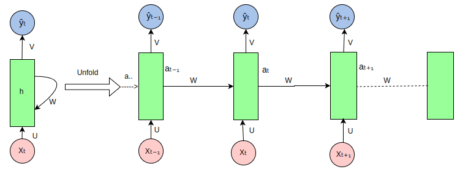

## PyTorch 循环神经网络（RNN）
循环神经网络（Recurrent Neural Networks, RNN）是一类神经网络架构，专门用于处理序列数据，能够捕捉时间序列或有序数据的动态信息，能够处理序列数据，如文本、时间序列或音频。

RNN 在自然语言处理（NLP）、语音识别、时间序列预测等任务中有着广泛的应用。

RNN 的关键特性是其能够保持隐状态（hidden state），使得网络能够记住先前时间步的信息，这对于处理序列数据至关重要。

### RNN 的基本结构
在传统的前馈神经网络（Feedforward Neural Network）中，数据是从输入层流向输出层的，而在 RNN 中，数据不仅沿着网络层级流动，还会在每个时间步骤上传播到当前的隐层状态，从而将之前的信息传递到下一个时间步骤。

- 隐状态（Hidden State）： RNN 通过隐状态来记住序列中的信息。

隐状态是通过上一时间步的隐状态和当前输入共同计算得到的。
公式：


- ht：当前时刻的隐状态。
- ht-1：前一时刻的隐状态。
- Xt：当前时刻的输入。
- Whh、Wxh：权重矩阵。
- b：偏置项。
- f：激活函数（如 Tanh 或 ReLU）。


**输出（Output）**： RNN 的输出不仅依赖当前的输入，还依赖于隐状态的历史信息。
公式：


- yt：当前时刻的隐状态。
- Why：当前时刻的隐状态。

### RNN 如何处理序列数据
循环神经网络（RNN）在处理序列数据时的展开（unfold）视图如下：



RNN 是一种处理序列数据的神经网络，它通过循环连接来处理序列中的每个元素，并在每个时间步传递信息，以下是图中各部分的说明：

 - **输入序列（Xt, Xt-1, Xt+1, ...）**：图中的粉色圆圈代表输入序列中的各个元素，如Xt表示当前时间步的输入，Xt-1表示前一个时间步的输入，以此类推。

- **隐藏状态（ht, ht-1, ht+1, ...）**：绿色矩形代表RNN的隐藏状态，它在每个时间步存储有关序列的信息。ht是当前时间步的隐藏状态，ht-1是前一个时间步的隐藏状态。

- **权重矩阵（U, W, V）**：

   - U：输入到隐藏状态的权重矩阵，用于将输入Xt转换为隐藏状态的一部分。
   - W：隐藏状态到隐藏状态的权重矩阵，用于将前一时间步的隐藏状态ht-1转换为当前时间步隐藏状态的一部分。
   - V：隐藏状态到输出的权重矩阵，用于将隐藏状态ht转换为输出Yt。
- **输出序列（Yt, Yt-1, Yt+1, ...）**：蓝色圆圈代表RNN在每个时间步的输出，如Yt是当前时间步的输出。

- **循环连接**：RNN的特点是隐藏状态的循环连接，这允许网络在处理当前时间步的输入时考虑到之前时间步的信息。

- **展开（Unfold）**：图中展示了RNN在序列上的展开过程，这有助于理解RNN如何在时间上处理序列数据。在实际的RNN实现中，这些步骤是并行处理的，但在概念上，我们可以将其展开来理解信息是如何流动的。

- **信息流动**：信息从输入序列通过权重矩阵U传递到隐藏状态，然后通过权重矩阵W在时间步之间传递，最后通过权重矩阵V从隐藏状态传递到输出序列。


***

## PyTorch 中的 RNN 基础
在 PyTorch 中，RNN 可以用于构建复杂的序列模型。
PyTorch 提供了几种 RNN 模块，包括：

- torch.nn.RNN：基本的RNN单元。
- torch.nn.LSTM：长短期记忆单元，能够学习长期依赖关系。
- torch.nn.GRU：门控循环单元，是LSTM的简化版本，但通常更容易训练。
使用 RNN 类时，您需要指定输入的维度、隐藏层的维度以及其他一些超参数。

### PyTorch 实现一个简单的 RNN 实例
以下是一个简单的 PyTorch 实现例子，使用 RNN 模型来处理序列数据并进行分类。

#### 1、导入必要库

实例
```python
import torch
import torch.nn as nn
import torch.optim as optim
from torch.utils.data import DataLoader, TensorDataset
import numpy as np
```


#### 2、定义 RNN 模型

实例
```python
class SimpleRNN(nn.Module):
    def __init__(self, input_size, hidden_size, output_size):
        super(SimpleRNN, self).__init__()
        # 定义 RNN 层
        self.rnn = nn.RNN(input_size, hidden_size, batch_first=True)
        # 定义全连接层
        self.fc = nn.Linear(hidden_size, output_size)

    def forward(self, x):
        # x: (batch_size, seq_len, input_size)
        out, _ = self.rnn(x)  # out: (batch_size, seq_len, hidden_size)
        # 取序列最后一个时间步的输出作为模型的输出
        out = out[:, -1, :]  # (batch_size, hidden_size)
        out = self.fc(out)  # 全连接层
        return out
```

#### 3、创建训练数据

为了训练 RNN，我们生成一些随机的序列数据。这里的目标是将每个序列的最后一个值作为分类的目标。

实例
```python

# 生成一些随机序列数据
num_samples = 1000
seq_len = 10
input_size = 5
output_size = 2  # 假设二分类问题

# 随机生成输入数据 (batch_size, seq_len, input_size)
X = torch.randn(num_samples, seq_len, input_size)
# 随机生成目标标签 (batch_size, output_size)
Y = torch.randint(0, output_size, (num_samples,))

# 创建数据加载器
dataset = TensorDataset(X, Y)
train_loader = DataLoader(dataset, batch_size=32, shuffle=True)
```

#### 4、定义损失函数与优化器

实例
```python
# 模型实例化
model = SimpleRNN(input_size=input_size, hidden_size=64, output_size=output_size)

# 定义损失函数和优化器
criterion = nn.CrossEntropyLoss()  # 多分类交叉熵损失
optimizer = optim.Adam(model.parameters(), lr=0.001)
```


#### 5、训练模型

实例
```python
num_epochs = 10

for epoch in range(num_epochs):
    model.train()  # 设置模型为训练模式
    total_loss = 0
    correct = 0
    total = 0

    for inputs, labels in train_loader:
        # 前向传播
        outputs = model(inputs)
        loss = criterion(outputs, labels)

        # 反向传播和优化
        optimizer.zero_grad()
        loss.backward()
        optimizer.step()

        total_loss += loss.item()

        # 计算准确率
        _, predicted = torch.max(outputs, 1)
        total += labels.size(0)
        correct += (predicted == labels).sum().item()

    accuracy = 100 * correct / total
    print(f"Epoch [{epoch+1}/{num_epochs}], Loss: {total_loss / len(train_loader):.4f}, Accuracy: {accuracy:.2f}%")
```

#### 6、测试模型

训练结束后，我们可以在测试集上评估模型的表现。

实例
```python
# 测试模型
model.eval()  # 设置模型为评估模式
with torch.no_grad():
    total = 0
    correct = 0
    for inputs, labels in train_loader:
        outputs = model(inputs)
        _, predicted = torch.max(outputs, 1)
        total += labels.size(0)
        correct += (predicted == labels).sum().item()

    accuracy = 100 * correct / total
    print(f"Test Accuracy: {accuracy:.2f}%")

```

### 7、完整代码如下：

```python
import torch
import torch.nn as nn
import torch.optim as optim
import matplotlib.pyplot as plt
import numpy as np

# 数据集：字符序列预测（Hello -> Elloh）
char_set = list("hello")
char_to_idx = {c: i for i, c in enumerate(char_set)}
idx_to_char = {i: c for i, c in enumerate(char_set)}

# 数据准备
input_str = "hello"
target_str = "elloh"
input_data = [char_to_idx[c] for c in input_str]
target_data = [char_to_idx[c] for c in target_str]

# 转换为独热编码
input_one_hot = np.eye(len(char_set))[input_data]

# 转换为 PyTorch Tensor
inputs = torch.tensor(input_one_hot, dtype=torch.float32)
targets = torch.tensor(target_data, dtype=torch.long)

# 模型超参数
input_size = len(char_set)
hidden_size = 8
output_size = len(char_set)
num_epochs = 200
learning_rate = 0.1

# 定义 RNN 模型
class RNNModel(nn.Module):
    def __init__(self, input_size, hidden_size, output_size):
        super(RNNModel, self).__init__()
        self.rnn = nn.RNN(input_size, hidden_size, batch_first=True)
        self.fc = nn.Linear(hidden_size, output_size)

    def forward(self, x, hidden):
        out, hidden = self.rnn(x, hidden)
        out = self.fc(out)  # 应用全连接层
        return out, hidden

model = RNNModel(input_size, hidden_size, output_size)

# 定义损失函数和优化器
criterion = nn.CrossEntropyLoss()
optimizer = optim.Adam(model.parameters(), lr=learning_rate)

# 训练 RNN
losses = []
hidden = None  # 初始隐藏状态为 None
for epoch in range(num_epochs):
    optimizer.zero_grad()

    # 前向传播
    outputs, hidden = model(inputs.unsqueeze(0), hidden)
    hidden = hidden.detach()  # 防止梯度爆炸

    # 计算损失
    loss = criterion(outputs.view(-1, output_size), targets)
    loss.backward()
    optimizer.step()
    losses.append(loss.item())

    if (epoch + 1) % 20 == 0:
        print(f"Epoch [{epoch + 1}/{num_epochs}], Loss: {loss.item():.4f}")

# 测试 RNN
with torch.no_grad():
    test_hidden = None
    test_output, _ = model(inputs.unsqueeze(0), test_hidden)
    predicted = torch.argmax(test_output, dim=2).squeeze().numpy()

    print("Input sequence: ", ''.join([idx_to_char[i] for i in input_data]))
    print("Predicted sequence: ", ''.join([idx_to_char[i] for i in predicted]))

```


### 代码解析：

#### 1 数据准备：

- 使用字符序列 hello，并将其转化为独热编码。
- 目标序列为 elloh，即向右旋转一个字符。
#### 2 模型构建：

- 使用 torch.nn.RNN 创建循环神经网络。
- 加入全连接层 torch.nn.Linear 用于映射隐藏状态到输出。
####  3 训练部分：

- 每一轮都计算损失并反向传播。
- 隐藏状态通过 hidden.detach() 防止梯度爆炸。
#### 4 测试部分：

- 模型输出字符的预测结果。
#### 5 可视化：

- 用 Matplotlib 绘制训练损失的变化趋势。
假设你的模型训练良好，输出可能如下：
```
Epoch [20/200], Loss: 0.0013
Epoch [40/200], Loss: 0.0003
Epoch [60/200], Loss: 0.0002
Epoch [80/200], Loss: 0.0001
Epoch [100/200], Loss: 0.0001
Epoch [120/200], Loss: 0.0001
Epoch [140/200], Loss: 0.0001
Epoch [160/200], Loss: 0.0001
Epoch [180/200], Loss: 0.0001
Epoch [200/200], Loss: 0.0001
Input sequence:  hello
```
从结果来看，图像显示损失逐渐减少，表明模型训练有效。


### 8、可视化代码：
实例
```python
import torch
import torch.nn as nn
import torch.optim as optim
import matplotlib.pyplot as plt
import numpy as np

# 数据集：字符序列预测（Hello -> Elloh）
char_set = list("hello")
char_to_idx = {c: i for i, c in enumerate(char_set)}
idx_to_char = {i: c for i, c in enumerate(char_set)}

# 数据准备
input_str = "hello"
target_str = "elloh"
input_data = [char_to_idx[c] for c in input_str]
target_data = [char_to_idx[c] for c in target_str]

# 转换为独热编码
input_one_hot = np.eye(len(char_set))[input_data]

# 转换为 PyTorch Tensor
inputs = torch.tensor(input_one_hot, dtype=torch.float32)
targets = torch.tensor(target_data, dtype=torch.long)

# 模型超参数
input_size = len(char_set)
hidden_size = 8
output_size = len(char_set)
num_epochs = 200
learning_rate = 0.1

# 定义 RNN 模型
class RNNModel(nn.Module):
    def __init__(self, input_size, hidden_size, output_size):
        super(RNNModel, self).__init__()
        self.rnn = nn.RNN(input_size, hidden_size, batch_first=True)
        self.fc = nn.Linear(hidden_size, output_size)

    def forward(self, x, hidden):
        out, hidden = self.rnn(x, hidden)
        out = self.fc(out)  # 应用全连接层
        return out, hidden

model = RNNModel(input_size, hidden_size, output_size)

# 定义损失函数和优化器
criterion = nn.CrossEntropyLoss()
optimizer = optim.Adam(model.parameters(), lr=learning_rate)

# 训练 RNN
losses = []
hidden = None  # 初始隐藏状态为 None
for epoch in range(num_epochs):
    optimizer.zero_grad()

    # 前向传播
    outputs, hidden = model(inputs.unsqueeze(0), hidden)
    hidden = hidden.detach()  # 防止梯度爆炸

    # 计算损失
    loss = criterion(outputs.view(-1, output_size), targets)
    loss.backward()
    optimizer.step()
    losses.append(loss.item())

    if (epoch + 1) % 20 == 0:
        print(f"Epoch [{epoch + 1}/{num_epochs}], Loss: {loss.item():.4f}")

# 测试 RNN
with torch.no_grad():
    test_hidden = None
    test_output, _ = model(inputs.unsqueeze(0), test_hidden)
    predicted = torch.argmax(test_output, dim=2).squeeze().numpy()

    print("Input sequence: ", ''.join([idx_to_char[i] for i in input_data]))
    print("Predicted sequence: ", ''.join([idx_to_char[i] for i in predicted]))

# 可视化损失
plt.plot(losses, label="Training Loss")
plt.xlabel("Epoch")
plt.ylabel("Loss")
plt.title("RNN Training Loss Over Epochs")
plt.legend()
plt.show()
```
执行后，显示图片如下所示：


