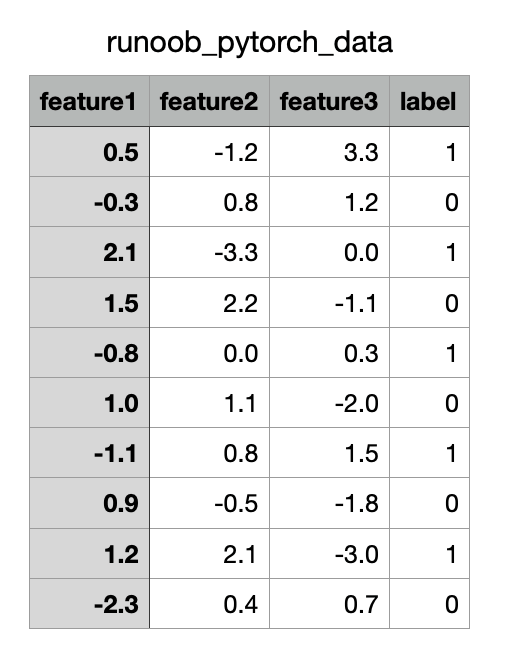

## PyTorch 数据集


在深度学习任务中，数据加载和处理是至关重要的一环。

PyTorch 提供了强大的数据加载和处理工具，主要包括：

- torch.utils.data.Dataset：数据集的抽象类，需要自定义并实现 __len__（数据集大小）和 __getitem__（按索引获取样本）。

- torch.utils.data.TensorDataset：基于张量的数据集，适合处理数据-标签对，直接支持批处理和迭代。

- torch.utils.data.DataLoader：封装 Dataset 的迭代器，提供批处理、数据打乱、多线程加载等功能，便于数据输入模型训练。

- torchvision.datasets.ImageFolder：从文件夹加载图像数据，每个子文件夹代表一个类别，适用于图像分类任务。


### PyTorch 内置数据集
PyTorch 通过 torchvision.datasets 模块提供了许多常用的数据集，例如：

- **MNIST**：手写数字图像数据集，用于图像分类任务。
- **CIFAR**：包含 10 个类别、60000 张 32x32 的彩色图像数据集，用于图像分类任务。
- **COCO**：通用物体检测、分割、关键点检测数据集，包含超过 330k 个图像和 2.5M 个目标实例的大规模数据集。
- **ImageNet**：包含超过 1400 万张图像，用于图像分类和物体检测等任务。
- **STL-10**：包含 100k 张 96x96 的彩色图像数据集，用于图像分类任务。
- **Cityscapes**：包含 5000 张精细注释的城市街道场景图像，用于语义分割任务。
- **SQUAD**：用于机器阅读理解任务的数据集。
以上数据集可以通过 torchvision.datasets 模块中的函数进行加载，也可以通过自定义的方式加载其他数据集。

### torchvision 和 torchtext
- **Storchvision**： 一个图形库，提供了图片数据处理相关的 API 和数据集接口，包括数据集加载函数和常用的图像变换。
- **Storchtext**： 自然语言处理工具包，提供了文本数据处理和建模的工具，包括数据预处理和数据加载的方式。
***


### torch.utils.data.Dataset
Dataset 是 PyTorch 中用于数据集抽象的类。

自定义数据集需要继承 torch.utils.data.Dataset 并重写以下两个方法：

- __len__：返回数据集的大小。
- __getitem__：按索引获取一个数据样本及其标签。
实例
```python
import torch
from torch.utils.data import Dataset

# 自定义数据集
class MyDataset(Dataset):
    def __init__(self, data, labels):
        # 数据初始化
        self.data = data
        self.labels = labels

    def __len__(self):
        # 返回数据集大小
        return len(self.data)

    def __getitem__(self, idx):
        # 按索引返回数据和标签
        sample = self.data[idx]
        label = self.labels[idx]
        return sample, label

# 生成示例数据
data = torch.randn(100, 5)  # 100 个样本，每个样本有 5 个特征
labels = torch.randint(0, 2, (100,))  # 100 个标签，取值为 0 或 1

# 实例化数据集
dataset = MyDataset(data, labels)

# 测试数据集
print("数据集大小:", len(dataset))
print("第 0 个样本:", dataset[0])
```
输出结果如下：
```
数据集大小: 100
第 0 个样本: (tensor([-0.2006,  0.7304, -1.3911, -0.4408,  1.1447]), tensor(0))
```

### torch.utils.data.DataLoader
DataLoader 是 PyTorch 提供的数据加载器，用于批量加载数据集。

提供了以下功能：

- 批量加载：通过设置 batch_size。
- 数据打乱：通过设置 shuffle=True。
- 多线程加速：通过设置 num_workers。
- 迭代访问：方便地按批次访问数据。

```python
import torch
from torch.utils.data import Dataset
from torch.utils.data import DataLoader

# 自定义数据集
class MyDataset(Dataset):
    def __init__(self, data, labels):
        # 数据初始化
        self.data = data
        self.labels = labels

    def __len__(self):
        # 返回数据集大小
        return len(self.data)

    def __getitem__(self, idx):
        # 按索引返回数据和标签
        sample = self.data[idx]
        label = self.labels[idx]
        return sample, label

# 生成示例数据
data = torch.randn(100, 5)  # 100 个样本，每个样本有 5 个特征
labels = torch.randint(0, 2, (100,))  # 100 个标签，取值为 0 或 1

# 实例化数据集
dataset = MyDataset(data, labels)
# 实例化 DataLoader
dataloader = DataLoader(dataset, batch_size=10, shuffle=True, num_workers=0)

# 遍历 DataLoader
for batch_idx, (batch_data, batch_labels) in enumerate(dataloader):
    print(f"批次 {batch_idx + 1}")
    print("数据:", batch_data)
    print("标签:", batch_labels)
    if batch_idx == 2:  # 仅显示前 3 个批次
        break
```

输出结果如下：

```
批次 1
数据: tensor([[ 0.4689,  0.6666, -1.0234,  0.8948,  0.4503],
        [ 0.0273, -0.4684, -0.7762,  0.7963,  0.2168],
        [ 1.0677, -0.3502, -0.9594, -1.1318, -0.2196],
        [-1.4989,  0.0267,  1.0405, -0.7284,  0.2335],
        [-0.5887, -0.4934,  1.6283,  1.4638,  0.0157],
        [-1.1047, -0.6550, -0.0381,  0.3617, -1.2792],
        [ 0.3592, -0.8264,  0.0231, -1.5508,  0.6833],
        [-0.6835,  0.6979,  0.9048, -0.4756,  0.3003],
        [ 1.1562, -0.4516, -1.2415,  0.2859,  0.5837],
        [ 0.7937,  1.5316, -0.6139,  0.7999,  0.5506]])
标签: tensor([0, 1, 1, 1, 1, 0, 1, 1, 0, 0])
批次 2
数据: tensor([[-0.0388, -0.3658,  0.8993, -1.5027,  1.0738],
        [-0.6182,  1.0684, -2.3049,  0.8338,  0.1363],
        [-0.5289,  0.1661, -0.0349,  0.2112,  1.4745],
        [-0.3304, -1.2114, -0.2982, -0.3006,  0.5252],
        [-1.4394, -0.3732,  1.0281,  0.5754,  1.0081],
        [ 0.8714, -0.1945, -0.2451, -0.2879, -2.0520],
        [ 0.0235,  0.4360,  0.1233,  0.0504,  0.5908],
        [ 0.5927,  0.1785, -0.9052, -0.9012,  0.8914],
        [ 0.4693,  0.5533, -0.1903,  0.0267,  0.4077],
        [-1.1683,  1.6699, -0.4846, -0.7404,  0.3370]])
标签: tensor([1, 1, 0, 1, 0, 1, 1, 0, 1, 1])
批次 3
数据: tensor([[ 0.2103, -0.7839,  1.4899,  2.2749, -0.7548],
        [-1.2836,  1.0025, -1.1162, -0.4261,  1.0690],
        [-0.7969,  1.0418, -0.7405,  0.8766,  0.2347],
        [-1.1071,  1.8560, -1.2979, -0.8364, -0.2925],
        [-1.0488,  0.4802, -0.6453,  0.2009,  0.5693],
        [ 0.8883,  0.4619, -0.2087,  0.2189, -0.3708],
        [-1.4578,  0.3629,  1.8282,  0.5353, -1.1783],
        [-1.2813,  0.5129, -0.4598, -0.2131, -1.2804],
        [ 1.7831,  1.1730, -0.2305, -0.6550,  0.1197],
        [-0.9384, -0.0483,  1.9626,  0.3342,  0.1700]])
标签: tensor([0, 0, 0, 1, 0, 1, 1, 1, 0, 1])
```

## 使用内置数据集
PyTorch 提供了多个常用数据集，存放在 torchvision 中，特别适合图像任务。

加载 MNIST 数据集:
实例
```python
import torchvision
import torchvision.transforms as transforms
from torch.utils.data import DataLoader

# 定义数据预处理
transform = transforms.Compose([
    transforms.ToTensor(),  # 转换为张量
    transforms.Normalize((0.5,), (0.5,))  # 标准化
])

# 加载训练数据集
train_dataset = torchvision.datasets.MNIST(
    root='./data', train=True, transform=transform, download=True)

# 使用 DataLoader 加载数据
train_loader = DataLoader(train_dataset, batch_size=32, shuffle=True)

# 查看一个批次的数据
data_iter = iter(train_loader)
images, labels = next(data_iter)
print(f"批次图像大小: {images.shape}")  # 输出形状为 [batch_size, 1, 28, 28]
print(f"批次标签: {labels}")
```
输出结果为：
```
批次图像大小: torch.Size([32, 1, 28, 28])
批次标签: tensor([0, 4, 9, 8, 1, 3, 8, 1, 7, 2, 1, 1, 1, 2, 6, 3, 9, 7, 6, 9, 4, 9, 7, 1,
        3, 7, 3, 0, 7, 7, 6, 7])
```

### Dataset 与 DataLoader 的自定义应用
以下是一个将 CSV 文件 作为数据源，并通过自定义 Dataset 和 DataLoader 读取数据。

CSV 文件内容如下（下载runoob_pytorch_data.csv）：


```python
import torch
import pandas as pd
from torch.utils.data import Dataset, DataLoader

# 自定义 CSV 数据集
class CSVDataset(Dataset):
    def __init__(self, file_path):
        # 读取 CSV 文件
        self.data = pd.read_csv(file_path)

    def __len__(self):
        # 返回数据集大小
        return len(self.data)

    def __getitem__(self, idx):
        # 使用 .iloc 明确基于位置索引
        row = self.data.iloc[idx]
        # 将特征和标签分开
        features = torch.tensor(row.iloc[:-1].to_numpy(), dtype=torch.float32)  # 特征
        label = torch.tensor(row.iloc[-1], dtype=torch.float32)  # 标签
        return features, label

# 实例化数据集和 DataLoader
dataset = CSVDataset("runoob_pytorch_data.csv")
dataloader = DataLoader(dataset, batch_size=4, shuffle=True)

# 遍历 DataLoader
for features, label in dataloader:
    print("特征:", features)
    print("标签:", label)
    break
```

输出结果为：

```
特征: tensor([[ 1.2000,  2.1000, -3.0000],
        [ 1.0000,  1.1000, -2.0000],
        [ 0.5000, -1.2000,  3.3000],
        [-0.3000,  0.8000,  1.2000]])
标签: tensor([1., 0., 1., 0.])
xxx@Mac-mini runoob-test % python3 test.py
特征: tensor([[ 1.5000,  2.2000, -1.1000],
        [ 2.1000, -3.3000,  0.0000],
        [-2.3000,  0.4000,  0.7000],
        [-0.3000,  0.8000,  1.2000]])
标签: tensor([0., 1., 0., 0.])
```