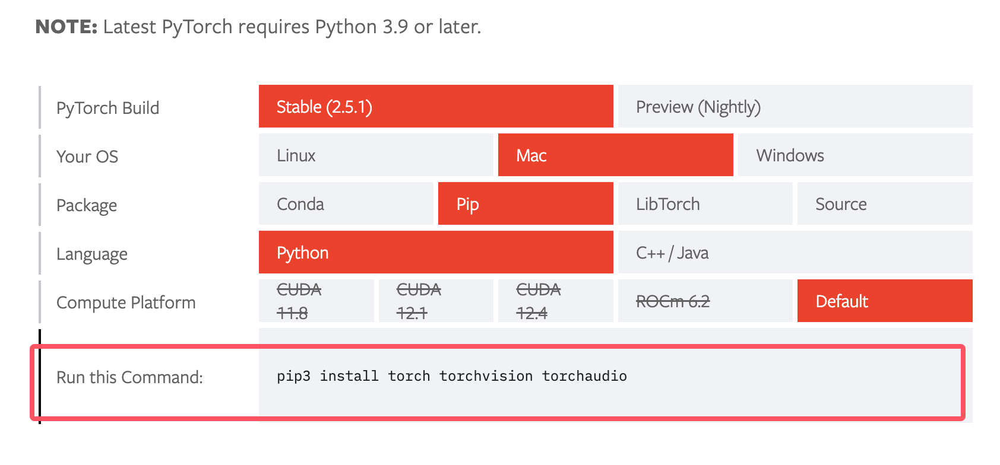

## PyTorch 安装
PyTorch 是一个流行的深度学习框架，支持 CPU 和 GPU 计算。

### 检查 Python 和 pip 版本
首先，确保你已安装 Python 和 pip，并且它们的版本满足 PyTorch 的要求。

最新版本的 PyTorch 需要 Python 3.9 及更高版本。

在终端或命令行中检查版本：
```

python --version
pip --version
```

***
## 安装 PyTorch
PyTorch 官方提供了几种安装方法，可以通过 pip 或 conda 进行安装。

#### 使用 pip 安装
使用 pip 安装 pytorch：
```
pip3 install torch torchvision
```
#### 使用 conda 安装
如果你使用 Anaconda 或 Miniconda 管理 Python 环境，使用 conda 安装 PyTorch 可能会更加简单和高效。
```
conda install pytorch torchvision -c pytorch
```
如果不了解Anaconda，可以参考： Anaconda 教程

#### 通过 PyTorch 官网安装
访问 PyTorch 的官方网站 https://pytorch.org/get-started/locally/，网站提供了一个方便的工具，可以根据你的系统配置（操作系统、包管理器、Python版本以及CUDA版本）推荐安装命令。



### 从源代码安装
如果你需要从源代码安装PyTorch，或者想要尝试最新的开发版本，你可以使用以下命令：
```
git clone --recursive https://github.com/pytorch/pytorch
cd pytorch
python setup.py install
```
这将从 GitHub 克隆 PyTorch 的源代码，并使用 setup.py 进行安装。

### 验证安装
为了确保 PyTorch 已正确安装，我们可以通过执行以下 PyTorch 代码来验证是否安装成功：

实例
```python
import torch

# 当前安装的 PyTorch 库的版本
print(torch.__version__)
# 检查 CUDA 是否可用，即你的系统有 NVIDIA 的 GPU
print(torch.cuda.is_available())
```
如果 ***torch.cuda.is_available()*** 输出 True，则说明 PyTorch 成功识别到你的 GPU。

一个简单的实例，构建一个随机初始化的张量：

实例
```python
import torch
x = torch.rand(5, 3)
print(x)
```
如果安装成功，输出结果类似如下：
```
tensor([[0.3380, 0.3845, 0.3217],
        [0.8337, 0.9050, 0.2650],
        [0.2979, 0.7141, 0.9069],
        [0.1449, 0.1132, 0.1375],
        [0.4675, 0.3947, 0.1426]])
```