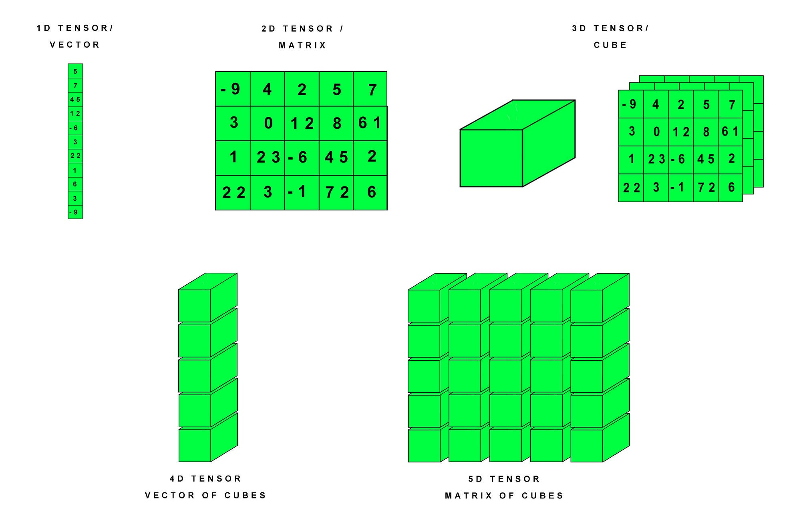

## PyTorch 张量（Tensor）
张量是一个多维数组，可以是标量、向量、矩阵或更高维度的数据结构。

在 PyTorch 中，张量（Tensor）是数据的核心表示形式，类似于 NumPy 的多维数组，但具有更强大的功能，例如支持 GPU 加速和自动梯度计算。

张量支持多种数据类型（整型、浮点型、布尔型等）。

张量可以存储在 CPU 或 GPU 中，GPU 张量可显著加速计算。

下图展示了不同维度的张量（Tensor）在 PyTorch 中的表示方法：


说明：

 - **1D Tensor / Vector（一维张量/向量）**: 最基本的张量形式，可以看作是一个数组，图中的例子是一个包含 10 个元素的向量。
 - **2D Tensor / Matrix（二维张量/矩阵）**: 二维数组，通常用于表示矩阵，图中的例子是一个 4x5 的矩阵，包含了 20 个元素。
 - **3D Tensor / Cube（三维张量/立方体）**: 三维数组，可以看作是由多个矩阵堆叠而成的立方体，图中的例子展示了一个 3x4x5 的立方体，其中每个 5x5 的矩阵代表立方体的一个"层"。
 - **4D Tensor / Vector of Cubes（四维张量/立方体向量）**: 四维数组，可以看作是由多个立方体组成的向量，图中的例子没有具体数值，但可以理解为一个包含多个 3D 张量的集合。
 - **5D Tensor / Matrix of Cubes（五维张量/立方体矩阵）**: 五维数组，可以看作是由多个4D张量组成的矩阵，图中的例子同样没有具体数值，但可以理解为一个包含多个 4D 张量的集合。

 ***

 ## 创建张量
张量创建的方式有：

|方法 |	说明|示例代码|
|----|----|----|
|torch.tensor(data)	|从 Python 列表或 NumPy 数组创建张量。	|x = torch.tensor([[1, 2], [3, 4]])|
|torch.zeros(size)	|创建一个全为零的张量。	|x = torch.zeros((2, 3))|
|torch.ones(size)	|创建一个全为 1 的张量。	|x = torch.ones((2, 3))|
|torch.empty(size)	|创建一个未初始化的张量。	|x = torch.empty((2, 3))|
|torch.rand(size)	|创建一个服从均匀分布的随机张量，值在 [0, 1)。	|x = torch.rand((2, 3))|
|torch.randn(size)	|创建一个服从正态分布的随机张量，均值为 0，标准差为 1。	|x = torch.randn((2, 3))|
|torch.arange(start, end, step)	|创建一个一维序列张量，类似于 Python 的 range。	|x = torch.arange(0, 10, 2)|
|torch.linspace(start, end, steps)	|创建一个在指定范围内等间隔的序列张量。	|x = torch.linspace(0, 1, 5)|
|torch.eye(size)	|创建一个单位矩阵（对角线为 1，其他为 0）。	|x = torch.eye(3)|
|torch.from_numpy(ndarray)	|将 NumPy 数组转换为张量。	|x = torch.from_numpy(np.array([1, 2, 3]))|

使用 **torch.tensor()** 函数，你可以将一个列表或数组转换为张量：

实例
```python
import torch

tensor = torch.tensor([1, 2, 3])
print(tensor)
```
输出如下：
```
tensor([1, 2, 3])
```

如果你有一个 NumPy 数组，可以使用 torch.from_numpy() 将其转换为张量：

实例
```python
import numpy as np

np_array = np.array([1, 2, 3])
tensor = torch.from_numpy(np_array)
print(tensor)
```
输出如下：
```
tensor([1, 2, 3])
```

创建 2D 张量（矩阵）：

实例
```python
import torch

tensor_2d = torch.tensor([
    [-9, 4, 2, 5, 7],
    [3, 0, 12, 8, 6],
    [1, 23, -6, 45, 2],
    [22, 3, -1, 72, 6]
])
print("2D Tensor (Matrix):\n", tensor_2d)
print("Shape:", tensor_2d.shape)  # 形状
```
输出如下：
```
2D Tensor (Matrix):
 tensor([[-9,  4,  2,  5,  7],
        [ 3,  0, 12,  8,  6],
        [ 1, 23, -6, 45,  2],
        [22,  3, -1, 72,  6]])
Shape: torch.Size([4, 5])
```

其他维度的创建：
```python
# 创建 3D 张量（立方体）
tensor_3d = torch.stack([tensor_2d, tensor_2d + 10, tensor_2d - 5])  # 堆叠 3 个 2D 张量
print("3D Tensor (Cube):\n", tensor_3d)
print("Shape:", tensor_3d.shape)  # 形状

# 创建 4D 张量（向量的立方体）
tensor_4d = torch.stack([tensor_3d, tensor_3d + 100])  # 堆叠 2 个 3D 张量
print("4D Tensor (Vector of Cubes):\n", tensor_4d)
print("Shape:", tensor_4d.shape)  # 形状

# 创建 5D 张量（矩阵的立方体）
tensor_5d = torch.stack([tensor_4d, tensor_4d + 1000])  # 堆叠 2 个 4D 张量
print("5D Tensor (Matrix of Cubes):\n", tensor_5d)
print("Shape:", tensor_5d.shape)  # 形状
``` 

## 张量的属性
张量的属性如下表


|方法 |	说明|示例代码|
|----|----|----|
|torch.tensor(data)	|从 Python 列表或 NumPy 数组创建张量。	|x = torch.tensor([[1, 2], [3, 4]])|


|.shape	|获取张量的形状	|tensor.shape|

.size()	获取张量的形状	tensor.size()
.dtype	获取张量的数据类型	tensor.dtype
.device	查看张量所在的设备 (CPU/GPU)	tensor.device
.dim()	获取张量的维度数	tensor.dim()
.requires_grad	是否启用梯度计算	tensor.requires_grad
.numel()	获取张量中的元素总数	tensor.numel()
.is_cuda	检查张量是否在 GPU 上	tensor.is_cuda
.T	获取张量的转置（适用于 2D 张量）	tensor.T
.item()	获取单元素张量的值	tensor.item()
.is_contiguous()	检查张量是否连续存储	tensor.is_contiguous()


实例