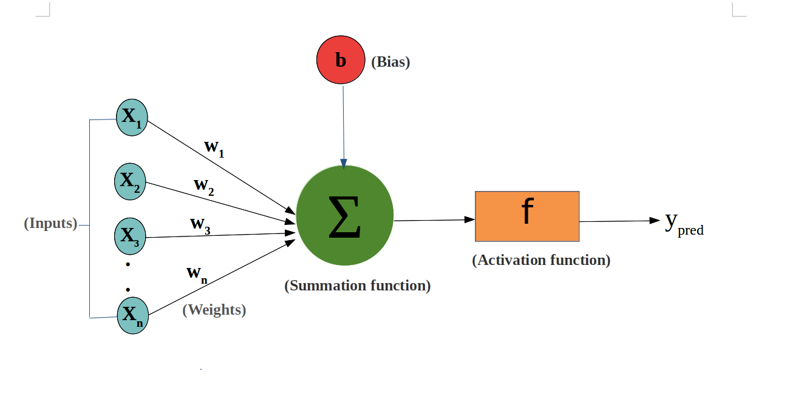
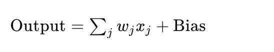
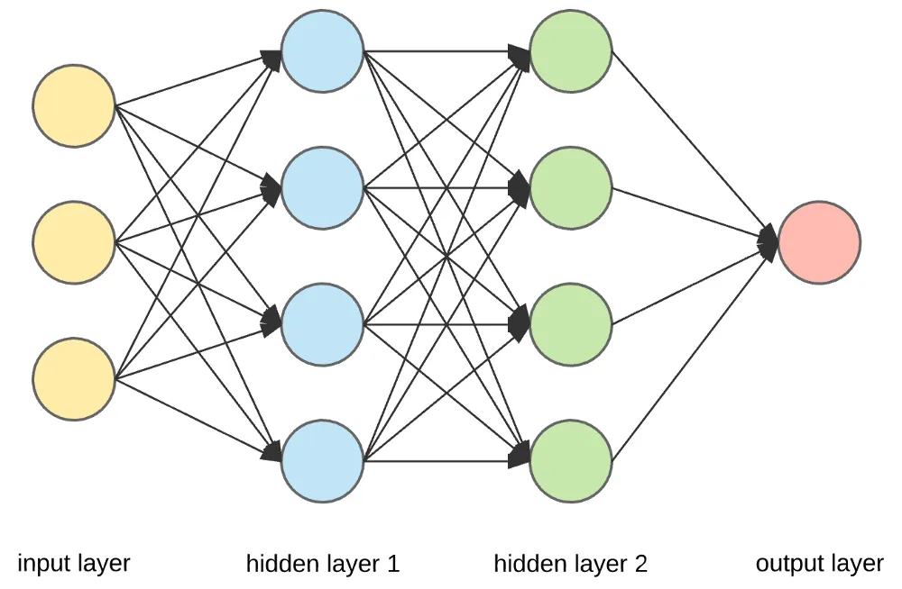
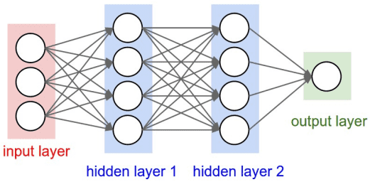
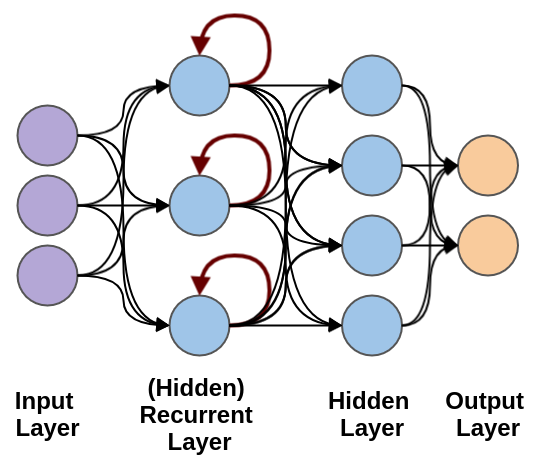
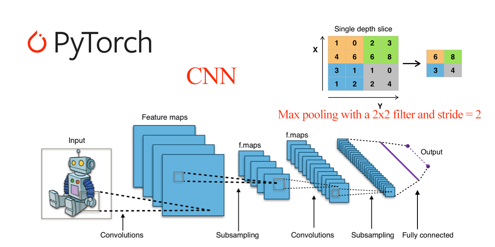

## PyTorch 神经网络基础

神经网络是一种模仿人脑处理信息方式的计算模型，它由许多相互连接的节点（神经元）组成，这些节点按层次排列。
神经网络的强大之处在于其能够自动从大量数据中学习复杂的模式和特征，无需人工设计特征提取器。
随着深度学习的发展，神经网络已经成为解决许多复杂问题的关键技术。

### 神经元（Neuron）
神经元是神经网络的基本单元，它接收输入信号，通过加权求和后与偏置（bias）相加，然后通过激活函数处理以产生输出。

神经元的权重和偏置是网络学习过程中需要调整的参数。

**输入和输出**:
 - 输入（Input）：输入是网络的起始点，可以是特征数据，如图像的像素值或文本的词向量。
 - 输出（Output）：输出是网络的终点，表示模型的预测结果，如分类任务中的类别标签。
神经元接收多个输入（例如x1, x2, ..., xn），如果输入的加权和大于激活阈值（activation potential），则产生二进制输出。



神经元的输出可以看作是输入的加权和加上偏置（bias），神经元的数学表示：



这里，**wj** 是权重，**xj** 是输入，而 **Bias** 是偏置项。

## 层（Layer）
输入层和输出层之间的层被称为隐藏层，层与层之间的连接密度和类型构成了网络的配置。

神经网络由多个层组成，包括：

 - 输入层（Input Layer）：接收原始输入数据。
 - 隐藏层（Hidden Layer）：对输入数据进行处理，可以有多个隐藏层。
 - 输出层（Output Layer）：产生最终的输出结果。
典型的神经网络架构 (Nerual Network Architecture):


## 前馈神经网络（Feedforward Neural Network，FNN）
前馈神经网络（Feedforward Neural Network，FNN）是神经网络家族中的基本单元。

前馈神经网络特点是数据从输入层开始，经过一个或多个隐藏层，最后到达输出层，全过程没有循环或反馈。


### 前馈神经网络的基本结构：

 - 输入层： 数据进入网络的入口点。输入层的每个节点代表一个输入特征。

 - 隐藏层：一个或多个层，用于捕获数据的非线性特征。每个隐藏层由多个神经元组成，每个神经元通过激活函数增加非线性能力。

 - 输出层：输出网络的预测结果。节点数和问题类型相关，例如分类问题的输出节点数等于类别数。

 - 连接权重与偏置：每个神经元的输入通过权重进行加权求和，并加上偏置值，然后通过激活函数传递。

### 循环神经网络（Recurrent Neural Network, RNN）
循环神经网络（Recurrent Neural Network, RNN）络是一类专门处理序列数据的神经网络，能够捕获输入数据中时间或顺序信息的依赖关系。

RNN 的特别之处在于它具有"记忆能力"，可以在网络的隐藏状态中保存之前时间步的信息。

循环神经网络用于处理随时间变化的数据模式。

在 RNN 中，相同的层被用来接收输入参数，并在指定的神经网络中显示输出参数。


PyTorch 提供了强大的工具来构建和训练神经网络。

神经网络在 PyTorch 中是通过 **torch.nn** 模块来实现的。

## 卷积神经网络（Convolutional Neural Networks, CNNs）

 **torch.nn** 模块提供了各种网络层（如全连接层、卷积层等）、损失函数和优化器，让神经网络的构建和训练变得更加方便。



在 PyTorch 中，构建神经网络通常需要继承 nn.Module 类。

nn.Module 是所有神经网络模块的基类，你需要定义以下两个部分：

 - __init__()：定义网络层。
 - forward()：定义数据的前向传播过程。

简单的全连接神经网络（Fully Connected Network）：

实例
```python
import torch
import torch.nn as nn

# 定义一个简单的神经网络模型
class SimpleNN(nn.Module):
    def __init__(self):
        super(SimpleNN, self).__init__()
        # 定义一个输入层到隐藏层的全连接层
        self.fc1 = nn.Linear(2, 2)  # 输入 2 个特征，输出 2 个特征
        # 定义一个隐藏层到输出层的全连接层
        self.fc2 = nn.Linear(2, 1)  # 输入 2 个特征，输出 1 个预测值
   
    def forward(self, x):
        # 前向传播过程
        x = torch.relu(self.fc1(x))  # 使用 ReLU 激活函数
        x = self.fc2(x)  # 输出层
        return x

# 创建模型实例
model = SimpleNN()

# 打印模型
print(model)
```

输出结果如下：
```
SimpleNN(
  (fc1): Linear(in_features=2, out_features=2, bias=True)
  (fc2): Linear(in_features=2, out_features=1, bias=True)
)
```

PyTorch 提供了许多常见的神经网络层，以下是几个常见的：

 - nn.Linear(in_features, out_features)：全连接层，输入 in_features 个特征，输出 out_features 个特征。
 - nn.Conv2d(in_channels, out_channels, kernel_size)：2D 卷积层，用于图像处理。
 - nn.MaxPool2d(kernel_size)：2D 最大池化层，用于降维。
 - nn.ReLU()：ReLU 激活函数，常用于隐藏层。
 - nn.Softmax(dim)：Softmax 激活函数，通常用于输出层，适用于多类分类问题。


## 激活函数（Activation Function）
激活函数决定了神经元是否应该被激活。它们是非线性函数，使得神经网络能够学习和执行更复杂的任务。常见的激活函数包括：

 - Sigmoid：用于二分类问题，输出值在 0 和 1 之间。
 - Tanh：输出值在 -1 和 1 之间，常用于输出层之前。
 - ReLU（Rectified Linear Unit）：目前最流行的激活函数之一，定义为 f(x) = max(0, x)，有助于解决梯度消失问题。
 - Softmax：常用于多分类问题的输出层，将输出转换为概率分布。
实例
```python
import torch.nn.functional as F

# ReLU 激活
output = F.relu(input_tensor)

# Sigmoid 激活
output = torch.sigmoid(input_tensor)

# Tanh 激活
output = torch.tanh(input_tensor)
```

## 损失函数（Loss Function）
损失函数用于衡量模型的预测值与真实值之间的差异。

常见的损失函数包括：

 - 均方误差（MSELoss）：回归问题常用，计算输出与目标值的平方差。
 - 交叉熵损失（CrossEntropyLoss）：分类问题常用，计算输出和真实标签之间的交叉熵。
 - BCEWithLogitsLoss：二分类问题，结合了 Sigmoid 激活和二元交叉熵损失。
实例
```python

# 均方误差损失
criterion = nn.MSELoss()

# 交叉熵损失
criterion = nn.CrossEntropyLoss()

# 二分类交叉熵损失
criterion = nn.BCEWithLogitsLoss()
```

## 优化器（Optimizer）
优化器负责在训练过程中更新网络的权重和偏置。

常见的优化器包括：

 - SGD（随机梯度下降）
 - Adam（自适应矩估计）
 - RMSprop（均方根传播）

实例
```python
import torch.optim as optim

# 使用 SGD 优化器
optimizer = optim.SGD(model.parameters(), lr=0.01)

# 使用 Adam 优化器
optimizer = optim.Adam(model.parameters(), lr=0.001)
```

## 训练过程（Training Process）
训练神经网络涉及以下步骤：

 - 1 准备数据：通过 DataLoader 加载数据。
 - 2 定义损失函数和优化器。
 - 3 前向传播：计算模型的输出。
 - 4 计算损失：与目标进行比较，得到损失值。
 - 5 反向传播：通过 loss.backward() 计算梯度。
 - 6 更新参数：通过 optimizer.step() 更新模型的参数。
 - 7 重复上述步骤，直到达到预定的训练轮数。

实例
```python

# 假设已经定义好了模型、损失函数和优化器

# 训练数据示例
X = torch.randn(10, 2)  # 10 个样本，每个样本有 2 个特征
Y = torch.randn(10, 1)  # 10 个目标标签

# 训练过程
for epoch in range(100):  # 训练 100 轮
    model.train()  # 设置模型为训练模式
    optimizer.zero_grad()  # 清除梯度
    output = model(X)  # 前向传播
    loss = criterion(output, Y)  # 计算损失
    loss.backward()  # 反向传播
    optimizer.step()  # 更新权重
   
    if (epoch + 1) % 10 == 0:  # 每 10 轮输出一次损失
        print(f'Epoch [{epoch + 1}/100], Loss: {loss.item():.4f}')

```

## 测试与评估
训练完成后，需要对模型进行测试和评估。

常见的步骤包括：

 - 计算测试集的损失：测试模型在未见过的数据上的表现。
 - 计算准确率（Accuracy）：对于分类问题，计算正确预测的比例。

实例
```python

# 假设你有测试集 X_test 和 Y_test
model.eval()  # 设置模型为评估模式
with torch.no_grad():  # 在评估过程中禁用梯度计算
    output = model(X_test)
    loss = criterion(output, Y_test)
    print(f'Test Loss: {loss.item():.4f}')
```


## 神经网络类型
- 1.前馈神经网络（Feedforward Neural Networks）：数据单向流动，从输入层到输出层，无反馈连接。
- 2.卷积神经网络（Convolutional Neural Networks, CNNs）：适用于图像处理，使用卷积层提取空间特征。
- 3.循环神经网络（Recurrent Neural Networks, RNNs）：适用于序列数据，如时间序列分析和自然语言处理，允许信息反馈循环。
- 4.长短期记忆网络（Long Short-Term Memory, LSTM）：一种特殊的RNN，能够学习长期依赖关系。